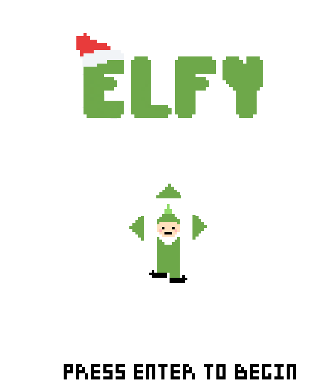
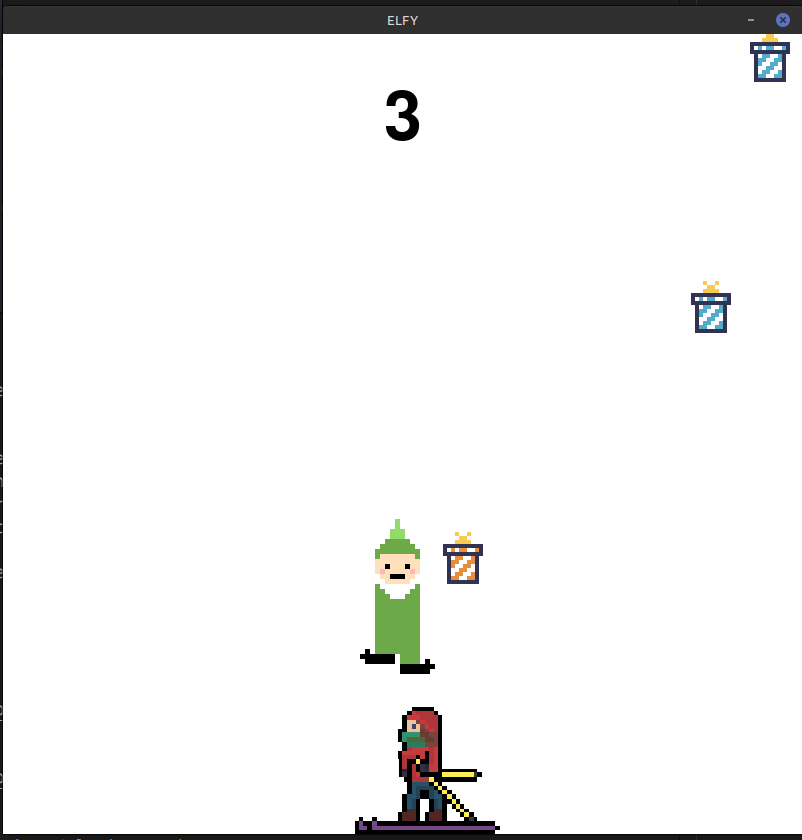

# ELFY 🎮🎄🎁  🤶


This game was created as a mini-project by `msardina`.
Elfy is a fun simple retro game about a green elf named Elfy whomust help Santa colect his presents. Have fun! :D

- Assume release date: Dec 30
- Creator: Marcos Sardina (`msardina`)
- Helper: Sebastian Sardina (`ssardina`)
- Genre: Quick-Paced Adventure
- Start Date: Dec 15
- Coding Language: 100% Python

## Story  :book:

Oh no! Santa has crashed on a local ski resort, all the presents are flying everywhere! Elfy must try and catch all of them so everyone can enjoy christmas. But there is a problem! There is skiers flying around everywhere. YOU must help Elfy dodge the skiers and collect the presents. Have fun!

## Instructions (how to download) 📝

You need to have Python and Pygame package.

Now clone this github repository and run the following command:

```shell
$ python main.py
```

You are now playing the game!

## How to play ▶️
Once on the title screen press enter to begin the game. Elfy should drop down where you can move around with the arrow keys.
Collect the colorful presents to earn a higher score but remember to be careful and dodge the skiers that come in from the sides.

If you find any glitches or problems please report an issue on this github repository.


## Screenshots 📷

- 
- 

# Gameplay

To watch gameplay click [here](https://www.youtube.com/watch?v=tCs4aJ8lckg)
  
## Credits 🎖️

- Code and art by Marcos Sardina (`msardina`)
- Sound effects from freesound.org
- Skier art created by reddit user @@a_lost_bookworm.
  


